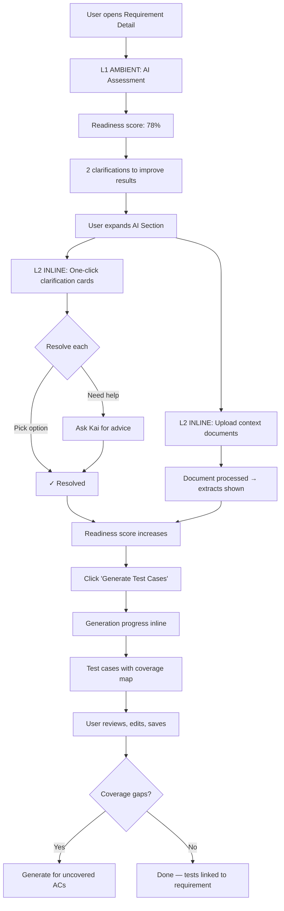
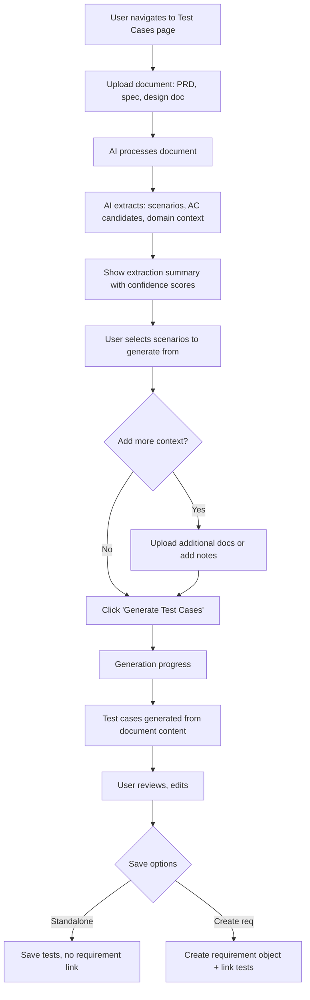

# Test Generator Agent

This repository contains the core specifications, logic, and prototypes for the **Test Generator Agent** — a unified Requirement Analyzer and Test Case Generator designed for Katalon TestOps.

## 🚀 Overview

The Test Generator Agent merges requirement analysis and test case generation into a single, high-fidelity experience. By moving away from detached generation and adopting an interactive, fully integrated workflow, it:
- Assesses requirements for completeness and testability.
- Surfaces structural ambiguities for user clarification.
- Generates high-precision test cases grounded in actual Jira data and contextual documents.

## 🔄 Core User Journeys

The agent operates across two primary journeys to support different testing maturity levels:

### J1: Requirement-Linked Generation

Designed for teams with established ALM workflows (e.g., Jira integration). Generation happens contextually on the Requirement Details page.



### J2: Document-Based (Ad-hoc) Generation

Designed for trial users, new projects, or teams lacking extensive ALM setups. Documents act as the primary generation context.



---

## 🏗️ Agent Pipelines

The system is built as a series of specialized agentic calls:

1. **Analyzer Pipeline**: Extracts structure and meaning.
   - **Call A (Extraction Agent):** Merges text, documents, and deterministic cues to extract classified Acceptance Criteria (AC).
   - **Call B (Analysis Agent):** Scores the quality across 7 dimensions (Clarity, Specificity, etc.) and generates actionable clarifications.

2. **Generator Agent**: Produces executable steps.
   - Takes confirmed ACs and boundary conditions and translates them into execution-ready test cases adhering strictly to **AI Test Runner** constraints. Every step maps directly back to the source AC.

3. **TC Quality Scorer**: Verifies reliability.
   - A deterministic layer evaluating every generated test against 9 rigid safety and quality rules before it reaches the user.

---

## 🛠️ Local Development & Prototyping

This repository includes a local development environment for previewing and testing agent components and UI prototypes.

### Prerequisites
- [Node.js](https://nodejs.org/) (v18 or higher)
- npm

### Setup & Run
1. **Install dependencies:**
   ```bash
   npm install
   ```
2. **Start the development server:**
   ```bash
   npm run dev
   ```
3. **Open the prototype:**
   Navigate to [http://localhost:5173/](http://localhost:5173/)

### Active Prototypes
- **TC Quality Scorer (v5.1):** Accessible via the root page. This prototype demonstrates the dual-scoring logic for test case quality and AI readiness. It is located at `snippets/TCDualScorer_v5.jsx` and mounted via `src/main.jsx`.

---

## 📁 Repository Structure

### Product Requirements
- [PRD & Scope](file:///Users/ha.nnguyen/TestOps%20Prototypes/test-case-generator/specs/prd/00_PRD_Test_Generator_Agent.md): Main product definitions, success metrics, and overall roadmap.

### Agent & Pipelines
- [J1 Jira-Linked Pipeline Spec](file:///Users/ha.nnguyen/TestOps%20Prototypes/test-case-generator/specs/pipelines/01_Spec_Pipeline_Analyzer_J1.md): Logic for requirement-first generation.
- [J2 Document-Based Pipeline Spec](file:///Users/ha.nnguyen/TestOps%20Prototypes/test-case-generator/specs/pipelines/02_Spec_Pipeline_Analyzer_J2.md): Logic for document-first generation.
- [Test Case Generator Spec](file:///Users/ha.nnguyen/TestOps%20Prototypes/test-case-generator/specs/agents/03_Spec_Agent_Test_Case_Generator.md): Generator logic, budgets, and prompts.

### Quality Logic & Rules
- [Test Case Quality Scorer Spec](file:///Users/ha.nnguyen/TestOps%20Prototypes/test-case-generator/specs/agents/04_Spec_Agent_Test_Case_Quality_Scorer.md): Quality Assessor logic.
- [Requirement Readiness Scoring Specs](file:///Users/ha.nnguyen/TestOps%20Prototypes/test-case-generator/specs/logic/05_Spec_Logic_Requirement_Scoring.md)
- [Requirement Scoring Rules (JS)](file:///Users/ha.nnguyen/TestOps%20Prototypes/test-case-generator/specs/logic/05_Rule_Requirement_Scoring.js)
- [TC Scorer Rules Summary](file:///Users/ha.nnguyen/TestOps%20Prototypes/test-case-generator/specs/logic/Ref_TC_Scorer_Rules.md)

## 🛠 Usage

This sandbox repository contains prompt engineering definitions and React components prototyping the interfaces. Developers must refer to the files in `specs/` for rule implementations before bridging updates to the core application.
