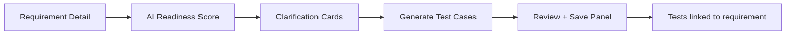
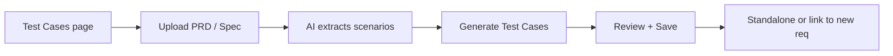

# TestOps Prototype Hub

A scalable, modular prototyping environment for Katalon TestOps Gen3 features. Prototypes are built to the same design system and can be iterated on independently without breaking the shared shell.

---

## 🚀 Getting Started

**Prerequisites:** Node.js v18+, npm

```bash
npm install
npm run dev
```

Open [http://localhost:5173/](http://localhost:5173/) → the Hub homepage lists all available prototypes.

---

## 🏗️ Architecture

The Hub is a **Vite + React** app structured around a shared Design System and a set of independent prototype modules.

```
src/
├── components/
│   ├── shell/               # Global UI: Layout, Sidebar, TopBar
│   └── shared/              # Reusable Design System components
│       ├── index.jsx         # Barrel export (Badge, Toast, Button, etc.)
│       └── ui/              # Macro-components (ListToolbar, RightDrawer, TestCaseTable)
├── utils/
│   └── design-system.js     # Token object (T, F) — colors, spacing, typography
├── pages/
│   └── Directory.jsx        # Hub homepage listing all prototypes
├── prototypes/
│   ├── manual-test-authoring/            # Manual Test Authoring prototype
│   │   ├── index.jsx                     # Entry point + global state
│   │   ├── components/                   # View components
│   │   ├── data/mockData.js              # Mock content
│   │   ├── utils/QualityEngine.js        # Scoring logic
│   │   ├── docs/                         # Feature specs & UX analysis
│   │   └── raw/                          # Original monolith + v1 legacy files
│   └── ai-test-case-generation/          # AI Test Case Generation prototype
│       ├── index.jsx
│       ├── components/
│       │   ├── EntryPages.jsx
│       │   ├── GenerationWorkspace.jsx
│       │   └── PostSaveView.jsx
│       ├── data/mockData.js
│       └── raw/                          # TCG-AI-Test-Case-Generation.jsx monolith
└── App.jsx                  # Routes
```

### Design System Rules
- All colors and font tokens come from `src/utils/design-system.js` (`T.*`, `F`).
- New components must consume `T.*` tokens — no hardcoded hex values.
- Shared macro-components live in `src/components/shared/ui/` and are exported through `src/components/shared/index.jsx`.

---

## 📦 Active Prototypes

| Prototype | Route | Status | Description |
|-----------|-------|--------|-------------|
| Manual Test Authoring | `/prototypes/manual-test-authoring` | Legacy | Step editor with AI quality scoring and AI Runner confidence. |
| AI Test Case Generation | `/prototypes/ai-test-case-generation` | Active | Full J1 + J2 generation flow with Kai pipeline, clarifications, and review panel. |

---

## 🤖 AI Agent Workflows

This repo is set up for **AI-assisted prototyping and decomposition**. Two skills govern this:

### `testops-prototyping` skill
Use when building a new prototype from scratch. Enforces the TestOps visual language (tokens, navigation shell, AI interaction layers).

### `testops-prototype-decomposition` skill
Use when given a new raw monolith file. Audits against the existing Design System, maps reusable components, flags new patterns for discussion, then executes the decomposition pipeline.

See `.gemini/antigravity/skills/` for the full instructions.

---

## 📁 Docs

- [`docs/LESSONS_LEARNED.md`](./docs/LESSONS_LEARNED.md) — 21 key architecture, prompt engineering, and quality decisions from the AI Test Case Generation feature sprint. Essential reading for engineering context.
- [`CHANGELOG.md`](./CHANGELOG.md) — Historical change log for prototype and spec iterations.

---

## 🔄 Core Feature — AI Test Case Generation

The AI prototype covers two user journeys:

### J1: Requirement-Linked Generation
Teams with Jira integration. Generation starts from the Requirement Detail page.



### J2: Document-Based Generation
Trial users or teams without ALM setup. Documents are the primary context.



**Demo toggle:** The J1 / J2 switch in the top bar lets you flip between the two journeys without reloading.
