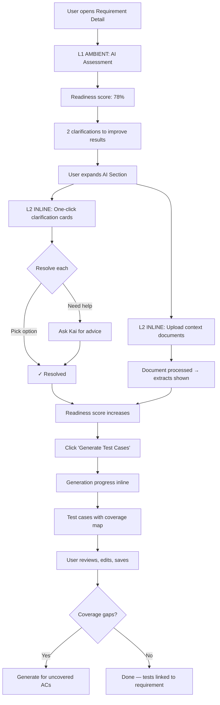
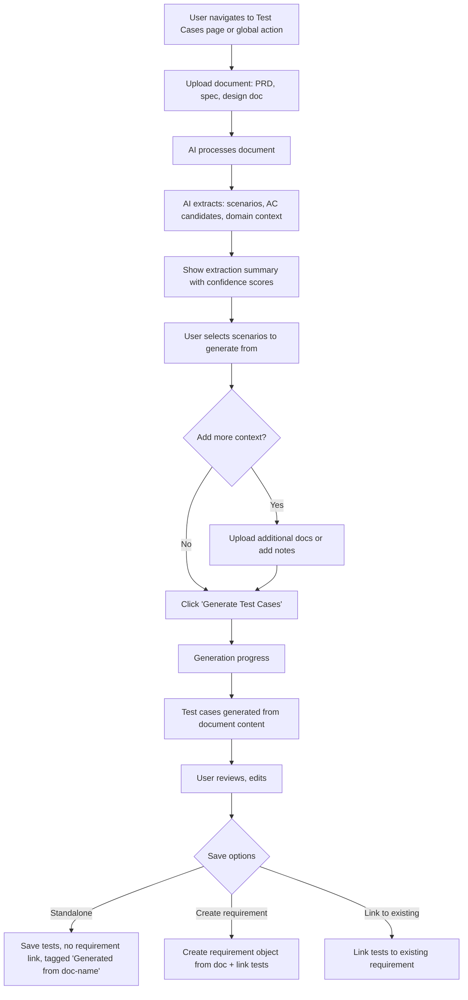

# Test Generator Agent — Scope & Requirements

**Owner:** Hà Nguyễn (PM, Manual + R&A) · **Reviewers:** Kim-Andre (Manual Tech Lead), Cristiano (VP), Vu Lam (CPO) · **Updated:** March 1, 2026
**Companion:** [Test Generator Agent — Launch Readiness](./TestGenerator_Agent_Launch_Readiness.md)

---

## 1. Purpose

The Test Generator Agent is a **combined Requirement Analyzer + Test Case Generator** — it analyzes requirements for completeness and testability, flags gaps, resolves ambiguities through structured inline refinement, and generates comprehensive test cases linked back to requirements and acceptance criteria.

This is **two previously separate agents merged into one workflow:** the Requirement Review Agent and the Test Case Generation Agent now operate as a single user-facing experience. The merge reflects both the natural workflow (users don't review requirements in isolation — they review to generate tests) and the timeline compression (4 weeks, not 8).

**What it does:**
- Analyzes requirement quality and testability (readiness score, gap detection, ambiguity flags) [J1]
- Surfaces structured inline clarifications with one-click resolution [J1]
- Processes uploaded context documents (PRDs, specs, API docs) to enrich test generation [J1 + J2]
- Generates comprehensive test cases with AC coverage mapping from requirements [J1]
- Generates test cases from uploaded documents without requiring ALM setup or linked requirements [J2]
- Saves generated test cases linked to the source requirement [J1] or as standalone tests [J2]
- **Unifies all generation paths** — Jira plugin, TestOps inline button, Kai, and J2 upload all use the same underlying agent engine

**What it does NOT do:**
- **Not the Autonomous Test Runner.** Test Generator creates test cases; Test Runner executes them. Test Runner is owned by TestCloud team for April.
- **Not the Insight Agent.** Insight Agent answers questions about testing metrics, coverage, and release readiness. Test Generator creates content, not reports.
- **Not the Bug Reporter.** Bug Reporter turns failures into Jira/ADO tickets. Test Generator creates tests, not defect reports.

**Interaction surfaces:** **J1:** Primarily **L2 Inline** (structured in-context UI on the Requirement Details page), with **L3 Kai** as escape hatch for open-ended questions. L1 Ambient provides the readiness score without user action. **J2:** **L2 Inline** upload + generation flow on the Test Cases page, with standalone save or requirement creation options.

**Audience:** This doc is for Manual team engineering (who build it), QA (who verify it), leadership (who track it), and cross-team dependencies (AI Platform team for Kai integration, Core team for requirement data models).

---

## 2. Priority Assessment

### True Platform Alignment

| Dimension | Assessment |
|-----------|-----------|
| **April 7 narrative fit** | ✅ One of five named launch agents. Powers the "requirements → tests" demo story — the core True to Intent pillar. |
| **Target persona** | ✅ Manual Testers (primary), QA Leads (secondary). Both are priority True Platform personas. |
| **Launch dependency** | ✅ Combined with Requirement Review — if this agent doesn't demo well, two of five launch agents fail. Test Runner depends on test cases this agent creates. |
| **Existing state** | ⚠️ AI test case generation feature exists but quality is poor (Boost Feb 2026 feedback: "not relevant or aligned with actual requirements"). Requirement analysis is new. |
| **Customer evidence** | ✅ iPipeline, Boost, Maybank, Virgin Voyages all need better test case generation. Document upload highly requested. |

### Scoring

| Factor | Score | Rationale |
|--------|-------|-----------|
| April impact | 4 (Critical) | Demo doesn't work without it — two of five agents depend on this. J2 journey is the trial/POC entry point. |
| Logo risk | 4 (Critical) | Boost feedback shows current AI quality undermines credibility; iPipeline needs knowledge-driven generation; trial users can't evaluate without J2 |
| Agent quality | 2 (Medium) | Existing generation exists but quality is poor; requirement analysis is new build; J2 is entirely new |
| Competitive diff | 4 (Critical) | Requirements-grounded generation (J1) + document-first generation without ALM setup (J2) is differentiator vs. generic AI tools and competitors requiring full setup |
| Effort | 3 (Medium) | 4 weeks, combined scope + J2 build, squat team supplementing |

**Score: (4×4) + (4×3) + (2×2) + (4×1) − (3×2) = 16 + 12 + 4 + 4 − 6 = 30 → Tier 1 (elevated)**

### Recommendation

Tier 1 — April blocker. This is the highest-priority agent for the Manual team. The squat team supplements core engineering. Heavy development must complete by March 23 (one week before launch for integration/stabilization). Ship the inline refinement MVP, not the full ambient AI vision.

---

## 2b. Current State — Known Problems

This is the comprehensive problem inventory driving the April build. Sources: engineering capacity alignment meeting (Feb 2026), Boost customer feedback (Feb 2026), GCash POC results, iPipeline/Virgin Voyages requests.

### Architecture & Integration Problems

| Problem | Impact | Source | Status |
|---------|--------|--------|--------|
| **Three fragmented paths using different engines.** Jira plugin, TestOps inline button, and Kai each use different AI engines with different quality, memory, and feature support. A user clicking "Generate Test" on a requirement page is NOT using the same agent shown in Kai demos. | Inconsistent experience. Quality is unpredictable depending on which entry point the user takes. Demo credibility risk. | Engineering capacity meeting | ✓ Raised — April unification required |
| **No project context or memory management.** AI doesn't know anything about the project — no designs, domain docs, feature specs, or supplemental context. Even a basic ChatGPT prompt produces better test cases because users can hand it richer, curated context. | Generic tests, not project-specific. Directly causes the quality gap. | Engineering capacity meeting, Boost Feb 2026 | ✓ Raised — document upload + context pipeline needed |
| **Document attachment only exists in Kai path.** Attaching docs for context enrichment works in Kai but not in the TestOps inline path. Building it separately for each path is unsustainable. | Feature fragmentation. Users must go to Kai for document context, inline for structured generation. Maintenance burden multiplies. | GCash, Boost | To address — unified pipeline needed |
| **Inline button exists but full generation flow doesn't.** Users see the "Generate Test Cases" button on the requirement page, but it lacks attachment support, refinement flow, and coverage analysis. To get those features, users must go through Kai chat — unintuitive, feels like a completely separate experience. | UX disconnect. Users discover the button, expect it to work fully, hit a wall, lose trust. | UX review | To address — L2 inline UX is the April build |

### AI Quality & Workflow Problems

| Problem | Impact | Source | Status |
|---------|--------|--------|--------|
| **Output quality below ChatGPT baseline.** Boost Feb 2026 feedback: "a basic ChatGPT prompt can produce better, more comprehensive test cases." Root cause: no project context, insufficient coverage of acceptance criteria. | Credibility damage. "AI saves 90% design time" claim directly undermined. If April ships with same quality, narrative is worse than not shipping. | Boost Feb 2026, engineering meeting | ✓ Raised — prompt engineering + context injection priority |
| **No testability readiness signal.** No ambient indicator of requirement quality before generating. Problems only surface after generation completes. Garbage in, garbage out — user wastes time. | User trust erodes when AI produces poor output without warning. No opportunity to improve input before wasting generation time. | UX review | To build — L1 ambient readiness score |
| **Refinement loop is chat-only.** Post-generation: edit, accept, reject requires typing in Kai. No structured one-click flow. No easy switch between UI and conversational interface. | Friction in iteration, slow refinement. Users who want to adjust one test step must enter a chat conversation instead of clicking a button. | Boost Feb 2026 | To build — L2 inline clarification and refinement UI |
| **No clarification step before generation.** AI generates without resolving requirement ambiguities. Output quality is unpredictable. | Unreliable results. Users lose trust after first bad generation. No path to iterative improvement before committing. | UX review | To build — clarification cards in L2 inline section |
| **Ad-hoc journey (J2) entirely absent.** No path to generate tests without a linked ALM requirement. Entire flow needs to be designed and built. | Blocks trial users, POC evaluators, and anyone without ALM setup. Eliminates the fastest path to demonstrating AI value. | Cross-agent review (also Insight Agent) | To build — J2 is April scope |

### Metrics & Feedback Problems

| Problem | Impact | Source | Status |
|---------|--------|--------|--------|
| **No success metrics defined.** There is no way to measure what a "meaningful" test case is. A quality gate (e.g., ≥90% of generated tests rated useful) must be defined before launch. | Can't validate improvement, can't measure success. No feedback loop for prompt engineering iteration. | Engineering meeting | ✓ Raised — see Section 12 (Success Metrics) |
| **No per-test feedback loop.** No thumbs up/down on generated tests. AI cannot improve from user corrections over time. | No learning. Quality stagnates. No signal for which tests are good vs. useless. | UX review | To build — feedback buttons on generated test cards |

### Problem Summary: What This Means for April

The current Test Generator is not a feature that needs polish — it's a feature that needs significant rework to be demo-credible. The three highest-impact problems are:

1. **Engine unification** — all entry points must use the same generation engine (the April agent)
2. **Context pipeline** — document upload + project context must feed into generation (addresses quality gap)
3. **Inline UX** — structured refinement flow replacing chat-only interaction (L2 before L3)

Without solving these three, the April demo will show the same quality users can get from pasting requirements into ChatGPT — and users will know it.

---

## 3. Operating Contexts

| Context | What It Covers | Who It Serves | Why It Matters |
|---------|---------------|---------------|----------------|
| **J1: Requirement Detail Page** (Primary) | Single requirement → analyze → refine → generate tests | Manual Testers, QA Leads | This is where requirement-linked generation happens. User is already looking at the requirement. |
| **J2: Document-Based (Ad-hoc)** | Upload PRD/spec/design doc → AI generates tests without requirement object in TestOps | Trial users, new projects, POC evaluators, teams without ALM setup | Enables generation without ALM integration or requirement import. Critical for onboarding, POCs, and evaluating AI quality before committing to full setup. |
| **Kai Entry (Cold Start)** | User asks Kai to generate tests for a requirement by ID, or says "I have a PRD, generate tests" | Exploratory users, QA Leads | Fallback for users who don't navigate to requirement detail or upload page first. Kai redirects to appropriate context (J1 or J2). |
| **Bulk Generation** (July) | Generate tests for multiple requirements in a release/sprint | QA Leads preparing for sprint | Not April scope. Requires batch processing and progress tracking. |
| **No Requirements Set Up** | User hasn't imported/created requirements yet | New users, trial users | Agent must surface J2 path ("Upload a document to generate tests") alongside requirement setup guidance. |

**April scope:** J1 Requirement Detail Page (primary) + J2 Document-Based (ad-hoc) + Kai Cold Start (redirect to J1 or J2). Bulk and cross-project are July.

### Why J2 is April-Critical

J2 is not a nice-to-have. It is the entry point for every trial user, POC evaluator, and customer who hasn't yet invested in ALM integration setup. Without J2, the "AI generates test cases" demo only works for users who have already imported requirements — a fraction of the April audience.

**Customer evidence:** iPipeline needs knowledge base/document context for generation. Virgin Voyages explicitly requested document upload to enrich context. Boost feedback showed AI quality suffers without domain context that documents provide. GCash and Maybank POC evaluations need J2 to demonstrate AI value before committing to full integration.

**Competitive gap:** Most competitors (TestSigma, Mabl) require project setup before AI features work. A document-first J2 path is a differentiator at the trial/evaluation stage.

---

## 4. User Journeys

### Entry Points → Agent

```mermaid
flowchart TD
    subgraph J1["J1: Requirement-Linked"]
        A[User on Requirement Details Page] --> B{AI Test Generation Section visible}
        B --> C[L1: Readiness Score displayed automatically]
        C --> D[User clicks to expand refinement]
        D --> E[L2: Inline clarifications, document upload, context]
        E --> F{Need help deciding?}
        F -->|Yes| G[Click 'Ask Kai' → L3 Kai opens with full context]
        F -->|No| H[Resolve clarifications inline, one-click]
        H --> I[Click 'Generate Test Cases']
        G --> J[Kai advises → User returns to inline section]
        J --> H
        I --> K[Test cases generated with AC coverage mapping]
        K --> L[Review, edit, save to requirement]
    end

    subgraph J2["J2: Document-Based (Ad-hoc)"]
        P[User navigates to Test Cases page] --> Q[Clicks 'Upload & Generate' or global action]
        Q --> R[Upload zone: drag/drop PRD, spec, design doc]
        R --> S[AI processes document, extracts test scenarios]
        S --> T[AI shows extracted scenarios with confidence]
        T --> U[User reviews, selects scenarios to generate from]
        U --> V[Click 'Generate Test Cases']
        V --> W[Test cases generated from document content]
        W --> X{Save options}
        X -->|Standalone| Y[Save as test cases, tagged 'Generated from doc-name']
        X -->|Create requirement| Z[Create requirement from doc + link tests]
    end

    subgraph Kai["Kai Cold Start"]
        M[User opens Kai directly] --> N{What do they ask?}
        N -->|"Generate tests for REQ-123"| O1[Kai redirects to J1: 'Navigate to requirement TO-8526 to generate tests']
        N -->|"I have a PRD, generate tests"| O2[Kai redirects to J2: 'Upload your document on the Test Cases page to generate tests']
    end
```

### J1: Generation Flow (Requirement-Linked — Primary Journey)

### J2: Generation Flow (Document-Based — Ad-hoc Journey)

### J2 Entry Points

| Entry Point | Location | Implementation |
|-------------|----------|----------------|
| **"Upload & Generate" button** | Test Cases list page toolbar | New action button, opens upload + generate flow |
| **Global "Generate from Document" action** | Navigation menu or Kai quick actions | New entry point, routes to J2 flow |
| **Kai redirect** | "I have a PRD, generate tests" in Kai | Kai provides link/redirect to J2 upload page |
| **No Requirements empty state** | Requirement list empty state | "No requirements yet? Upload a document to generate test cases directly." |

---

## 5. Core Rules

| Rule | Description | Testable By |
|------|-------------|-------------|
| **Never fabricate requirements.** | Agent only works with requirement data that exists in TestOps. If a requirement has no acceptance criteria, agent flags this — does not invent AC. | QA: Create requirement with no AC → verify agent flags gap, does not generate fake AC |
| **Readiness score is deterministic.** | Score calculation uses fixed formula (base 65 + resolved clarifications × 10 + all resolved × 5 + documents × 10, cap 98). Same inputs = same score. | QA: Verify score consistency across page reloads |
| **One-click resolution for structured choices.** | Clarifications that have discrete options use inline buttons. Chat is NEVER used for structured choices. | QA: Verify all clarifications with options render as buttons, not chat prompts |
| **Context handoff to Kai is mandatory.** | When user clicks "Ask Kai," full context transfers: requirement, clarifications, documents, generated tests. Kai must NEVER open blank from an AI surface. | QA: Click "Ask Kai" → verify Kai has requirement context pre-loaded |
| **Generated tests link to AC.** | Every generated test case must reference which acceptance criterion it covers. Orphan tests (no AC link) are flagged. | QA: Generate tests → verify each has linkedAC field populated |
| **Document upload is non-blocking.** | Upload processes asynchronously. User can continue resolving clarifications while documents process. | QA: Upload large PDF → verify clarification interaction continues |
| **AI-generated content is clearly labeled.** | All AI-generated test cases show "✨ AI Generated" badge. After user edits, badge changes to "✨ AI Generated · Edited." | QA: Generate → verify badge. Edit → verify badge update. |
| **Empty state is helpful.** | If requirement has no description or AC, show "This requirement needs more detail before test cases can be generated" with link to edit requirement. | QA: Navigate to empty requirement → verify helpful guidance shown |

---

## 6. Response Format & Presentation Strategy

### The Problem

Current AI test case generation produces output directly in the test case list without readiness assessment, context refinement, or coverage analysis. Boost customer feedback (Feb 2026): AI-generated test cases "are not relevant or aligned with actual requirements, often requiring significant manual rework."

### April Approach (Inline MVP)

All interaction happens in-context on the Requirement Detail page. No artifacts, no separate windows.

| Output Type | Format | Where It Appears |
|-------------|--------|-----------------|
| Readiness score | Ambient badge (L1) | AI Test Generation section header — always visible |
| Clarifications | Inline cards with one-click buttons (L2) | Expandable section within AI Test Generation |
| Document extracts | Inline summary cards (L2) | Below document upload area after processing |
| Coverage analysis | Inline summary with AC ↔ test mapping (L2) | Below generated test case list |
| Generated test cases | Standard test case list items (L2) | Existing test case list on the page |
| Kai conversation | Floating side panel (L3) | Triggered by "Ask Kai" links |

### July Vision (Componentized)

- Dynamic clarification generation (not just from requirement text — from cross-project patterns)
- Smart coverage recommendations based on historical test patterns
- Per-AC test quality scoring
- Batch generation across multiple requirements

### Three-Layer AI UX Mapping

| Layer | What It Does | User Action Required | April State |
|-------|-------------|---------------------|-------------|
| **L1 Ambient** | Readiness score, gap count badge | None — automatic | Build |
| **L2 Inline** | Clarification cards, document upload, coverage summary, test list | Click to expand, one-click resolve, drag-drop upload | Build (primary effort) |
| **L3 Conversational** | Open-ended help via Kai with context | Click "Ask Kai" | Depends on Kai integration readiness |

### File Type Support Roadmap

File type support must be clearly documented and published for CS/Sales. This is the source of truth for what the agent accepts.

#### April Launch (MVP)

| Format | Extension(s) | Processing | Notes |
|--------|-------------|------------|-------|
| **PDF** | `.pdf`, `.PDF` | Text extraction, basic structure recognition (headings, sections) | Most common PRD format. Uppercase extension must be fixed (known G3 bug). |
| **Word** | `.docx`, `.DOCX` | Full text extraction with heading hierarchy | Common for requirements documents. |
| **Plain text** | `.txt`, `.TXT` | Direct text intake | Simplest path. Useful for pasted specs. |
| **Markdown** | `.md`, `.MD` | Structure-aware parsing (headings, lists, tables) | Common in Git-based teams. |

**April limitations:** No image processing (screenshots, wireframes). No Figma support. No API spec parsing. No video processing. These are documented as "coming soon."

**Known bug to fix:** Uppercase file extensions (`.PNG`, `.PDF`) are currently rejected across G3. Must be resolved before April launch — this blocks document upload on both J1 and J2 journeys.

#### July Milestone

| Format | Extension(s) | Processing | Why July |
|--------|-------------|------------|---------|
| **Figma exports** | `.fig` (via URL/embed) | Design context extraction, UI flow identification | Requires Figma API integration; enables design-to-test workflow |
| **Images** | `.png`, `.jpg`, `.jpeg`, `.gif` | Wireframe recognition, mockup analysis, screenshot context | Requires vision model integration |
| **OpenAPI/Swagger** | `.yaml`, `.json` (API spec) | Endpoint extraction, API test case generation | Enables API testing use case |
| **Improved PDF processing** | `.pdf` | Table extraction, diagram recognition, better structure parsing | Iteration on April foundation |

#### Post-July

| Format | Processing | Why Later |
|--------|------------|-----------|
| **Video** (`.mp4`, `.webm`) | Demo recording analysis, walkthrough extraction | Requires video processing pipeline |
| **Confluence/Notion pages** | Direct page import via URL | Requires third-party API integration |
| **Jira epic/story bulk import** | Import Jira context for generation | Requires batch processing + ALM integration enhancement |
| **Code repository context** | Source code context for automation script generation | Requires Git integration; separate from manual test generation |

**CS/Sales reference:** Publish the April table as a standalone document for customer inquiries. Update after each milestone. Track customer requests for unlisted formats to inform priority.

---

## 7. Discoverability & Entry Points

### J1 Entry: Requirement Detail Page

The AI Test Generation section lives on every Requirement Detail page, visible by default (collapsed state showing readiness score).

| Entry Point | Type | Context Passed | Implementation |
|-------------|------|---------------|----------------|
| **AI Test Generation section** (Requirement Detail) | Always-visible inline section | Full requirement context: ID, title, description, AC, linked tests | New component on existing page |
| **"Generate Tests" button** (Requirement Detail toolbar) | Action button | Requirement ID | Scrolls to + expands AI section |
| **Kai "Ask Kai" links** (within AI section) | Context bridge | Requirement + clarifications + documents + trigger context | Opens Kai side panel |

### J2 Entry: Document-Based (Ad-hoc) Generation

| Entry Point | Type | Context Passed | Implementation |
|-------------|------|---------------|----------------|
| **"Upload & Generate" button** (Test Cases list page) | Action button in toolbar | Project context only (no requirement) | New button → opens J2 upload flow |
| **"Generate from Document" global action** | Navigation menu action or Kai quick action | None (user provides document) | New global action routing to J2 flow |
| **No Requirements empty state link** | Empty state CTA on Requirements page | Project context | "No requirements yet? Upload a document to generate test cases directly." → routes to J2 |
| **Kai redirect** | Kai response to "I have a PRD" type queries | Kai conversation context | Kai provides link to J2 upload page with instructions |

### Not Adding Entry Points To

- **Test Run pages** — execution context, not creation
- **Dashboard/Reports** — analysis context, not creation
- **Every requirement in a list** — too much noise; user navigates to detail page first

### April: Static prompts only

Kai prompt chips below AI section are static per page type, not dynamically generated from on-screen data. Dynamic prompts are July scope.

---

## 8. Scenarios — Requirement Analysis (Merged from Requirement Review Agent)

| Scenario | Example | Expected Behavior | Status |
|----------|---------|-------------------|--------|
| **Requirement with clear AC** | Requirement with 5 well-defined acceptance criteria | Readiness score 85%+, 0-1 clarifications, ready to generate | To validate |
| **Requirement with ambiguous AC** | AC says "system should handle high load" | Readiness score 60-70%, clarification: "What does 'high load' mean? [100 users] [1000 users] [10000 users] [Custom]" | To validate |
| **Requirement with no AC** | Only title and description, no acceptance criteria | Readiness score <50%, message: "Add acceptance criteria to improve test generation quality. [Add AC]" | To validate |
| **Requirement with no description** | Title only: "Login feature" | Empty state: "This requirement needs more detail. [Edit Requirement]" | To validate |
| **Ambiguity in technical terms** | AC mentions "consistent data" without defining tolerance | Clarification card with domain-relevant options + "Ask Kai for advice" link | To validate |
| **Multiple ambiguities** | 3+ unclear terms in requirement | All clarifications shown, prioritized by impact on test quality. Readiness score reflects unresolved count. | To validate |
| **User resolves clarification** | Clicks "Within 1%" for tolerance question | Clarification marked resolved ✓, readiness score increases, option is stored for generation context | To validate |
| **User clicks "Ask Kai"** | Needs help understanding timezone implications | Kai opens with full requirement context + specific clarification highlighted. Kai explains implications. User returns to inline section. | Blocked (Kai integration) |

---

## 9. Scenarios — Document Processing

| Scenario | Example | Expected Behavior | Status |
|----------|---------|-------------------|--------|
| **Upload single PDF** | User drags PRD.pdf onto upload zone | Processing indicator → extracted content summary → readiness score increases | To validate |
| **Upload multiple documents** | PRD + API spec + design doc | Each processed independently. Relevant extracts consolidated. Duplicate info deduplicated. | To validate |
| **Document answers clarification** | PRD defines "high load" as "1000 concurrent users" | Clarification auto-resolved with source quote. Badge: "Auto-resolved from PRD.pdf" | To validate |
| **Irrelevant document** | User uploads unrelated meeting notes | Low relevance score. Message: "Limited relevant content found. Consider uploading specs or PRDs for this requirement." | To validate |
| **Large document (>10MB)** | Enterprise compliance doc, 200 pages | Processing takes longer, progress indicator shown. Only relevant sections extracted. | To validate |
| **Unsupported format** | User uploads .exe file | "Supported formats: PDF, DOCX, TXT, MD. Please upload a document in one of these formats." | To validate |
| **File with uppercase extension** | Document.PNG or Spec.PDF | Accepted and processed correctly. (Known G3 bug: uppercase extensions rejected — must be fixed.) | Needs fix |

---

## 10. Scenarios — Test Case Generation

| Scenario | Example | Expected Behavior | Status |
|----------|---------|-------------------|--------|
| **Generate from well-defined requirement** | 5 ACs, all clarifications resolved, 1 context doc | Test cases generated covering each AC. Coverage summary shows 100%. Each test has: name, objective, preconditions, steps, expected results, linked AC. | To validate |
| **Generate with partial refinement** | 2 of 4 clarifications resolved | Tests generated with warning: "2 unresolved clarifications may affect quality for AC-3 and AC-4." Coverage shows gaps for unresolved ACs. | To validate |
| **Generate with no refinement** | User clicks Generate immediately | Tests generated at base quality. Readiness score shown as context. Message: "Resolving clarifications could improve test relevance." | To validate |
| **Positive + negative tests** | Standard generation request | Both positive (happy path) and negative (boundary, error) tests generated. Test type labeled on each. | To validate |
| **Coverage gap detected** | AC-5 not covered by any generated test | Coverage analysis highlights gap. "Generate Tests for Uncovered AC" button for AC-5. | To validate |
| **Regenerate after edit** | User modifies requirement, clicks regenerate | Existing AI-generated tests flagged: "Requirement updated — regenerate to align?" Previously edited tests preserved. | To validate |
| **Generation fails (API error)** | AI service timeout | "Test generation encountered an issue. [Retry] or [Report Problem]." No partial/corrupt tests saved. | To validate |
| **Generation for boundary cases** | AC specifies "age must be 18-65" | Boundary value tests: exactly 18, exactly 65, 17, 66, 0, negative, very large number. | To validate |
| **AI quality — aligned with requirements** | Requirement about login validation | Tests specifically reference login fields, error messages, and validation rules from the requirement — not generic login tests. (Addresses Boost feedback.) | To validate |
| **Save generated tests** | User clicks "Save All" or selects specific tests | Tests saved as test cases linked to requirement. Author tagged as "AI Generated." Appear in test case list. | To validate |
| **Edit before save** | User modifies AI-generated test step | Edited test saved with "AI Generated · Edited" badge. Edit is preserved on regeneration. | To validate |

---

## 10a. Scenarios — J2 Document-Based Generation (Ad-hoc Journey)

| Scenario | Example | Expected Behavior | Status |
|----------|---------|-------------------|--------|
| **Upload PRD without requirement** | User drags PRD.pdf to J2 upload zone | AI extracts test scenarios from document content. Shows extraction summary with confidence scores. User selects scenarios → generates tests. Tests saved as standalone (no requirement link), tagged "Generated from PRD.pdf". | To build |
| **Upload and create requirement** | User generates from doc, clicks "Create Requirement" | Requirement object created with doc content as description. Generated tests auto-linked to new requirement. Requirement tagged "Created from document." | To build |
| **Upload and link to existing requirement** | User generates from doc, clicks "Link to existing requirement" | Modal to search/select existing requirement. Tests saved linked to selected requirement. | To build |
| **Multiple documents for context** | User uploads PRD + design doc + API spec | AI processes all documents, synthesizes context across files. Extraction summary shows which content came from which doc. Generation uses combined context. | To build |
| **Upload design mockup** (July) | User uploads Figma export or screenshot | AI extracts UI flows, generates UI-focused test cases (navigation, form validation, visual states). | July scope |
| **Upload API spec** (July) | User uploads OpenAPI YAML | AI generates API test cases with endpoint coverage: positive responses, error codes, boundary values. | July scope |
| **Save generated tests without requirement (standalone)** | User generates from doc, clicks "Save as Test Cases" | Tests saved to project in specified folder. No requirement link. Author: "AI Generated." Tags include "Generated from [doc-name]" and source document reference. | To build |
| **J2 with empty/irrelevant document** | User uploads a meeting notes doc unrelated to testing | AI detects low testability content. Message: "Limited test scenarios found in this document. Try uploading a PRD, specification, or requirements document for better results." | To build |
| **J2 entry from empty requirements state** | User on Requirements page with no requirements imported | Empty state shows: "No requirements yet? [Upload a document to generate test cases directly]." Link routes to J2 upload flow. | To build |
| **J2 via Kai cold start** | User tells Kai "I have a PRD, generate tests" | Kai responds with link/redirect to J2 upload page: "Upload your document on the Test Cases page — I'll generate test cases from it." | To build |
| **J2 file type rejected** | User uploads .fig file (not supported in April) | "This file type is not yet supported. Currently accepted: PDF, DOCX, TXT, MD. Figma support is coming in a future update." | To build |
| **J2 feedback on generated tests** | User reviews J2-generated tests, clicks 👍/👎 on individual tests | Feedback recorded. Aggregate feedback informs prompt engineering iteration. (April: visual feedback buttons. Backend aggregation is July.) | To build |

---

## 11. Scenarios — Edge Cases & Error Handling

| Scenario | Example | Expected Behavior | Status |
|----------|---------|-------------------|--------|
| **No Jira/ADO integration** | Standalone project, requirements created manually | Full functionality available. No ALM-specific features shown. | To validate |
| **Requirement from Jira sync** | Requirement imported via Jira integration | All Jira fields available as context. AC mapped from Jira acceptance criteria or sub-tasks. | To validate |
| **Very long requirement** | 2000+ word requirement with 15 ACs | Processed fully. Clarifications prioritized by impact. Generation may take longer — progress indicator shown. | To validate |
| **Concurrent users** | Two users generating for same requirement simultaneously | Both get results independently. No data corruption. Last-save-wins for test case edits. | To validate |
| **Browser refresh mid-generation** | User refreshes during generation | Generation continues server-side. On reload, shows progress or completed results. No duplicate tests. | To validate |
| **Permission denied** | Viewer role tries to generate | "Generate Tests" button disabled. Tooltip: "Test generation requires Editor or Admin role." | To validate |

---

## 12. Success Metrics

### Tier 1: Pre-Launch — Agent Quality (QE-verified)

| Gate | Criteria | Done When |
|------|----------|-----------|
| Readiness score accuracy | Score reflects actual requirement quality | 10 test requirements with varying quality → scores correlate with manual assessment |
| Clarification relevance | Clarifications address real ambiguities | 10 requirements → 80%+ of clarifications are genuinely useful (manual review) |
| Test-to-AC mapping | Every generated test links to at least one AC | 10 generation runs → 100% of tests have linkedAC populated |
| Test quality (basic) | Generated tests have clear steps and expected results | 10 generation runs → no tests with empty steps or generic "verify it works" expected results |
| Coverage completeness | Generated tests collectively cover all ACs | 10 requirements with 3+ ACs → all ACs have at least one test |
| Error handling | Failures show clean messages | Simulate 5 error conditions → all show user-friendly messages, no raw errors |
| **Quality vs ChatGPT baseline** | Generated tests are demonstrably better than pasting requirement into ChatGPT | Side-by-side comparison of 5 requirements: agent output rated better or equivalent by PM on specificity, coverage, and relevance |
| **J2 document-to-tests flow** | J2 journey produces tests from uploaded document | Upload 5 different PRDs → tests generated with scenarios extracted from document content, not generic |
| **File type acceptance** | All April file types accepted including uppercase extensions | Upload PDF, DOCX, TXT, MD (both lowercase and uppercase extensions) → all accepted and processed |

### Tier 2: Post-Launch — Adoption Signals (30-day)

| Metric | What We Track |
|--------|--------------|
| Total generations triggered (J1 + J2) | Absolute count, weekly trend, split by journey type |
| Unique users generating | Absolute count, weekly trend |
| **J2 adoption rate** | J2 generations as % of total — tells us if ad-hoc path is used |
| Clarifications resolved vs. skipped | Ratio — tells us if refinement adds value |
| Documents uploaded per generation | Average count — tells us if document context is used |
| Tests saved vs. discarded | Ratio — proxy for generation quality |
| **Per-test thumbs up/down ratio** | Tells us which test types are useful vs. useless |
| "Ask Kai" click rate | Should be <20% — tells us if inline handles most needs |

### Tier 3: Post-Launch — Value Signals (60-day)

| Metric | What We Track |
|--------|--------------|
| Customer feedback on test quality | Qualitative — does it actually save time? |
| Edit rate on generated tests | How much users modify before saving — lower = better quality |
| Repeat usage | Do users come back after first generation? |

**Pre-PMF note:** Sample size will be small. Track absolute counts and trends. Don't set percentage targets.

---

## 13. Out of Scope

| Excluded | Why | When | Handled By |
|----------|-----|------|-----------|
| Test execution | Different agent, different team | N/A | Autonomous Test Runner (TestCloud team) |
| Bulk generation across releases | Timeline — requires batch processing infra | July | Manual team |
| AI-generated test data | Quality risk — need to validate generation first | July | Manual team |
| Dynamic clarification prompts | Requires AI-to-AI chain validation we can't cover | July | Manual team (static prompts for April) |
| Cross-project requirement analysis | Requires cross-project data access | July | Core + R&A teams |
| Automation script generation | Separate capability from manual test cases | Post-July | Manual team |
| Knowledge base integration | iPipeline requested, needs KB infrastructure | July (MCP-KB-001) | AI Platform team |
| Requirement quality scoring stored as metadata | Dependency: `requirement_quality` field doesn't exist in data model yet | Depends on Core | Core team — see Risks |
| Author source tracking on generated content | Dependency: `author_source` field doesn't exist | Depends on Core | Shared dependency with Insight Agent — see Risks |
| **Figma file support** | Requires Figma API integration + design parsing | July | Manual team |
| **Image processing (wireframes, screenshots)** | Requires vision model integration | July | Manual team + AI Platform |
| **OpenAPI/Swagger spec parsing** | Requires structured API spec parser | July | Manual team |
| **Video processing (demo recordings)** | Requires video processing pipeline | Post-July | Manual team + AI Platform |
| **Confluence/Notion page import** | Requires third-party API integrations | Post-July | Core team (integration) |
| **Per-test AI learning from feedback** | Backend aggregation and prompt improvement from thumbs up/down | July (buttons ship April, backend learning July) | Manual team + AI Platform |

---

## 14. Cross-Agent Dependencies

### Shared with Insight Agent

The Insight Agent (R&A team) has overlapping data model dependencies:

| Dependency | Test Generator Needs It For | Insight Agent Needs It For | Owner | Status |
|-----------|---------------------------|--------------------------|-------|--------|
| `author_source` metadata | Tagging test cases as "AI Generated" vs "Human" | Showing AI vs. human contribution breakdown in reports | Core team | Not built |
| `requirement_quality` scoring | Readiness score persistence (so it doesn't recompute on every page load) | Requirement coverage quality metrics | Core team | Not built |
| Kai context handoff API | "Ask Kai" bridge from inline section | AI Briefing → Kai follow-up | AI Platform team | Unknown readiness |

**Decision needed:** If `author_source` isn't built by code freeze, fallback is client-side badge only (no backend persistence). This means Insight Agent can't report on AI vs. human content. Escalate if not resolved by March 10.

---

## Appendix: Sample Questions (for demo prep and QA test cases)

**Requirement Analysis (J1):**
1. "Why is the readiness score only 65%?"
2. "What does 'consistent' mean in AC-3?"
3. "This requirement seems incomplete — what's missing?"

**Document Context (J1 + J2):**
4. "Does the uploaded PRD answer any of my clarifications?"
5. "What relevant info did you extract from the API spec?"
6. "I uploaded a PRD — what test scenarios did you find?"

**Test Generation (J1):**
7. "Generate test cases for this requirement"
8. "Why didn't you cover AC-5?"
9. "Generate more negative test cases"
10. "These tests are too generic — make them specific to our login flow"

**Document-Based Generation (J2):**
11. "I have a PRD, generate test cases from it"
12. "Generate tests from this spec doc — I don't have requirements set up yet"
13. "Save these tests without linking to a requirement"
14. "Create a requirement from this document and link the tests"

**Coverage:**
15. "Which acceptance criteria have no tests?"
16. "How many tests should I expect for this requirement?"
17. "Compare coverage before and after this generation"

**Feedback:**
18. "This test is not useful" (thumbs down)
19. "This test accurately captures the expected behavior" (thumbs up)

---

## Reference

| Document | Link |
|----------|------|
| Test Case Generator Ambient AI Approach (Final) | Project knowledge: `TestCaseGenerator_Ambient_AI_Approach_Final.md` |
| In-context AI UX conversation | [Claude chat](https://claude.ai/chat/69e59b15-8bbf-4c4e-952c-a6411493a3ae) |
| Insight Agent scope conversation | [Claude chat](https://claude.ai/chat/d73f72f9-d577-441c-bea3-fc45c16121b7) |
| Scout & Test Runner comparison | [Claude chat](https://claude.ai/chat/5814e9f5-0f36-424d-8e99-15b00a64685f) |
| Interactive prototype (v6) | `TestCaseGenerator_Ambient_AI_Prototype_v6.jsx` |
| True Platform Revenue Enablement | Project: `True_Platform__Revenue_Enablement_2_9_2026.pdf` |
| Customer feedback (Boost) | Project: `Customer_Feedbacks__BOOST__TestOps_issues_challenges.xlsx` |
